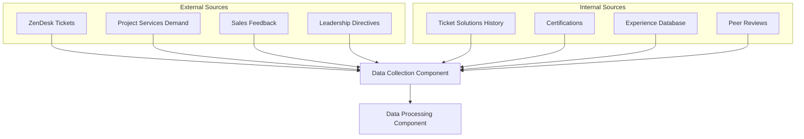

# Data Collection Component

The Data Collection Component is responsible for gathering both external demand signals and internal skills information to power the DoIT Skills Orchestration System.

## Overview

This component serves as the foundation of the system, continuously monitoring and collecting data from various sources to identify skill demand patterns and track employee expertise.

## Key Subcomponents

### External Demand Signal Collection

#### ZenDesk Integration

- **Real-time Ticket Monitor**: Continuously tracks ticket volume, categories, and resolution patterns
- **Subject Matter Classifier**: Uses NLP to categorize tickets by technology domain and skill requirements
- **Environment Detector**: Identifies which cloud environments are referenced in tickets
- **Time-Series Analyzer**: Detects trends and patterns in ticket volumes over time

#### Project Services Demand Tracker

- **Request Pipeline Monitor**: Tracks incoming project requests and required skills
- **Skill Requirements Extractor**: Analyzes project requirements to identify needed expertise
- **Historical Project Analyzer**: Identifies patterns in past successful projects

#### Sales Team Feedback Collector

- **Structured Feedback Forms**: Provides templates for sales teams to report market trends
- **Unstructured Feedback Processor**: Uses NLP to extract insights from free-text comments
- **Client Request Tracker**: Monitors requested capabilities not currently offered

#### Leadership Strategic Input

- **Priority Declaration System**: Captures strategic initiatives and their skill implications
- **Market Direction Assessments**: Tracks leadership expectations about future technology trends
- **Organizational Goal Mapping**: Links company objectives to skill requirements

### Internal Skills Repository

#### Ticket Resolution History

- **Engineer Performance Tracker**: Tracks ticket resolution speed and quality by employee
- **Subject Matter Expertise Detector**: Identifies recurring patterns in successful ticket resolutions
- **Skill Growth Monitor**: Tracks improvements in resolution metrics over time

#### Certification Management

- **Certification Validator**: Verifies and records official certifications
- **Expiration Tracker**: Monitors certification validity and notifies about upcoming renewals
- **Certification Value Analyzer**: Correlates certifications with job performance metrics

#### Experience Database

- **CV Parser**: Extracts structured experience data from employee resumes
- **Project History Collector**: Records participation in internal projects
- **Technology Experience Counter**: Tracks years of experience with specific technologies

#### Peer Recognition System

- **Expertise Nomination Tool**: Allows employees to nominate colleagues as subject matter experts
- **Knowledge Sharing Tracker**: Records mentoring, training, and documentation contributions
- **Informal Leadership Detector**: Identifies employees others frequently consult for help

## Data Collection Principles

1. **Respect for Privacy**: Only collect data relevant to skill development with appropriate consent
2. **Data Minimization**: Store only what's necessary for the system's purpose
3. **Transparency**: Make data collection methods visible to all employees
4. **Accuracy**: Implement validation mechanisms to ensure data quality
5. **Timeliness**: Maintain collection schedules that balance freshness with system load

## Integration Points

| System | Integration Type | Data Collected | Refresh Frequency |
|--------|------------------|----------------|-------------------|
| ZenDesk | API | Ticket metadata, resolution metrics | Real-time |
| HR System | Database | Certifications, CV data | Daily |
| Project Management | API | Project requirements, allocations | Hourly |
| Sales CRM | Webhook | Client requests, market feedback | Real-time |
| Internal Surveys | Form API | Peer recognition, skill self-assessment | Monthly |

## Implementation Considerations

- **Rate Limiting**: Respect API rate limits when collecting data from external systems
- **Error Handling**: Implement robust error recovery for data collection interruptions
- **Validation**: Verify data integrity before passing to the processing layer
- **Scheduling**: Stagger collection jobs to avoid system performance impacts
- **Logging**: Maintain comprehensive logs of collection activities for troubleshooting

## Future Enhancements

- Integration with industry certification databases for automatic verification
- Implementation of machine learning for improved ticket classification
- Addition of external market data sources for broader demand signal collection
- Development of specialized skill taxonomies for emerging technology domains