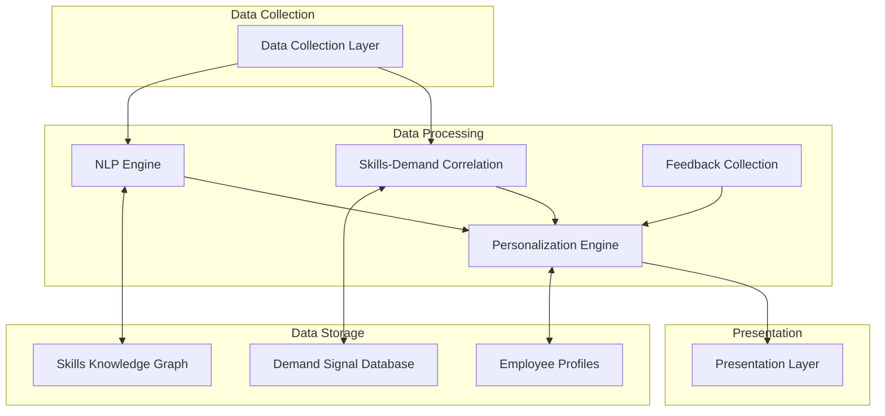

# Data Processing Component

The Data Processing Component forms the intelligence layer of the DoIT Skills Orchestration System, transforming raw data into actionable insights about skill demand and development opportunities.

## Overview

This component is responsible for analyzing collected data, identifying patterns and correlations, and generating personalized recommendations for both individual employees and the organization as a whole.

## Key Subcomponents

### Natural Language Processing Engine

#### Cloud Technology Terminology Recognition

- **Domain-Specific Entity Recognition**: Identifies cloud services, platforms, and technologies
- **Terminology Standardization**: Maps variant terms to standard taxonomy
- **New Technology Detection**: Recognizes emerging technologies not yet in standard taxonomies

#### Intent Classification

- **Query Purpose Detector**: Determines the type of information being requested
- **Career Goal Recognizer**: Identifies long-term development objectives in queries
- **Urgency Classifier**: Distinguishes between immediate and long-term skill needs

#### Entity Extraction

- **Technology Mention Detector**: Identifies specific platforms and services
- **Skill Level Assessor**: Determines the expertise level being discussed
- **Timeline Extractor**: Identifies timeframes mentioned in queries

#### Context Management

- **Conversation History Tracker**: Maintains context across multiple interactions
- **Query Disambiguator**: Resolves unclear references to previous topics
- **User Profile Linker**: Connects conversations to user context

### Skills-Demand Correlation Engine

#### ZenDesk Ticket Pattern Analysis

- **Volume Trend Analyzer**: Identifies growing or declining ticket categories
- **Complexity Assessor**: Evaluates the difficulty level of different ticket types
- **Resolution Path Analyzer**: Maps successful solution approaches to skill requirements

#### Project Request Forecasting

- **Pipeline Projector**: Predicts future project skill needs based on sales pipeline
- **Seasonal Pattern Detector**: Identifies cyclical demand for certain skills
- **Client Industry Analyzer**: Correlates client industries with technology requirements

#### Client Service Demand Trending

- **Service Utilization Monitor**: Tracks which managed services see growing demand
- **Client Feedback Analyzer**: Identifies service quality issues linked to skill gaps
- **Competitive Analysis**: Compares service offerings with market alternatives

#### Strategic Priority Alignment

- **Leadership Directive Interpreter**: Translates strategic goals to skill requirements
- **Gap Analysis Engine**: Identifies misalignment between strategy and current skills
- **Roadmap Generator**: Creates skill development timelines aligned with strategic goals

### Personalization Engine

#### Learning Style Adaptation

- **Learning Preference Detector**: Identifies optimal learning approaches per employee
- **Content Format Selector**: Matches recommendations to preferred learning formats
- **Pace Optimizer**: Suggests appropriate learning velocity based on past patterns

#### Career Progression Path Generation

- **Role Transition Mapper**: Identifies skill paths between current and target roles
- **Growth Opportunity Finder**: Suggests projects that build desired skills
- **Expertise Deepening Advisor**: Recommends specialist knowledge development

#### Certification Timeline Optimization

- **Preparation Time Estimator**: Calculates study time needed based on background
- **Cost-Benefit Analyzer**: Ranks certifications by value to career and organization
- **Sequencing Optimizer**: Suggests optimal order for pursuing multiple certifications

#### Success Pattern Recognition

- **High Performer Analysis**: Identifies skill patterns among top performers
- **Career Velocity Calculator**: Measures skill acquisition speed and career advancement
- **Learning Efficiency Maximizer**: Identifies most effective learning approaches

### Feedback Collection System

#### Skill Acquisition Impact Tracking

- **Ticket Performance Monitor**: Measures changes in resolution metrics after training
- **Productivity Impact Analyzer**: Quantifies efficiency gains from new skills
- **Knowledge Application Detector**: Identifies when newly learned skills are applied

#### Project Delivery Improvement Tracking

- **Delivery Time Analyzer**: Measures impact of skills on project timelines
- **Quality Metric Monitor**: Tracks improvements in deliverable quality
- **Innovation Detector**: Identifies novel approaches enabled by new skills

#### Client Satisfaction Correlation

- **Feedback Analyzer**: Links client satisfaction to specific skills
- **Renewal Rate Monitor**: Correlates skill investments with client retention
- **Expansion Opportunity Tracker**: Identifies skill-enabled upsell opportunities

#### Team Performance Enhancement

- **Skill Complementarity Analyzer**: Identifies how skills combine for team effectiveness
- **Knowledge Transfer Monitor**: Tracks how skills spread within teams
- **Team Capability Assessor**: Evaluates overall team skill coverage

## Processing Principles

1. **Explainability**: Ensure processing logic can be understood by users
2. **Privacy Preservation**: Maintain appropriate anonymization in aggregate analysis
3. **Bias Mitigation**: Regularly audit for and correct algorithmic biases
4. **Continuous Improvement**: Refine algorithms based on recommendation outcomes
5. **Contextual Relevance**: Consider organizational context in all analysis

## Technical Implementation

### Core Technologies

- **Natural Language Processing**: Transformer-based models fine-tuned for DoIT's domain
- **Knowledge Graph**: Property graph database for modeling skill relationships
- **Time Series Analysis**: Statistical methods for identifying demand trends
- **Recommendation Systems**: Hybrid collaborative/content-based filtering approach
- **Machine Learning Pipeline**: Continuous training and evaluation workflow

### Processing Flow

1. Raw data ingestion from collection layer
2. Data cleaning and normalization
3. Feature extraction and enrichment
4. Pattern detection and correlation analysis
5. Personalized recommendation generation
6. Confidence scoring and explanation production
7. Delivery to presentation layer

## Future Enhancements

- Incorporation of transfer learning to improve NLP performance with limited data
- Implementation of causal inference methods to better measure skill impact
- Development of reinforcement learning for optimization of skill development paths
- Integration of explainable AI techniques for more transparent recommendations