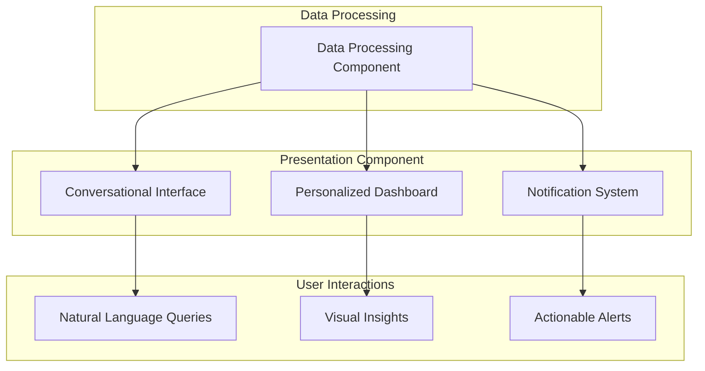

# Presentation Component

The Presentation Component provides the interface between the DoIT Skills Orchestration System and its users, delivering personalized insights through natural language conversations and visual dashboards.

## Overview

This component transforms complex data and recommendations into accessible, actionable information tailored to each user's context and preferences.

## Key Subcomponents

### Conversational Interface

#### Natural Language Q&A

- **Intent Recognition**: Accurately identifies the purpose of user queries
- **Context Management**: Maintains conversation history for coherent multi-turn interactions
- **Domain-Specific Understanding**: Comprehends cloud technology terminology and concepts
- **Answer Generation**: Produces clear, concise responses to user questions
- **Citation Integration**: Provides source information for recommendations

#### Workplace Chat Integration

- **Platform Connectors**: Integrates with Slack, Microsoft Teams, and other workplace chat tools
- **Multi-Channel Consistency**: Maintains conversation context across different platforms
- **Notification Preferences**: Respects user channel preferences for different message types
- **Rich Message Formatting**: Utilizes platform-specific features for optimal information display

#### Voice Assistant Option

- **Speech Recognition**: Processes spoken queries with high accuracy
- **Speech Synthesis**: Delivers natural-sounding voice responses
- **Hands-Free Operation**: Enables skill development discussions during other tasks
- **Voice Authentication**: Secures voice interactions with speaker recognition

#### Query Templates

- **Common Questions Library**: Provides suggested queries for first-time users
- **Personalized Suggestions**: Offers query templates based on user role and history
- **Template Customization**: Allows users to save and modify frequent queries
- **Query Expansion**: Helps users refine broad questions into specific actionable queries

### Personalized Dashboard

#### Skill Heat Map

- **Strength Visualization**: Displays individual skills mapped against demand intensity
- **Gap Highlighting**: Identifies areas where high demand meets low coverage
- **Temporal View**: Shows how skill demand has changed over time
- **Comparative Analysis**: Optional benchmarking against team or organization averages

#### Certification Roadmap

- **Prioritized Certification Path**: Visualizes recommended certification sequence
- **Timeline Integration**: Shows study time estimates and optimal timing
- **Prerequisite Mapping**: Clarifies dependencies between certifications
- **Value Indicators**: Displays demand metrics for each certification

#### ZenDesk Performance Metrics

- **Resolution Efficiency**: Charts ticket handling metrics by technology domain
- **Trend Analysis**: Shows improvement over time in specific skill areas
- **Complexity Handling**: Highlights capability with increasingly difficult tickets
- **Comparative Metrics**: Optional anonymous comparison with peer performance

#### Peer Recognition Visualization

- **Knowledge Leadership**: Displays areas where peers seek the user's expertise
- **Contribution Impact**: Shows how knowledge sharing affects team performance
- **Community Standing**: Represents overall recognition within the organization
- **Recognition Evolution**: Tracks changes in peer acknowledgment over time

### Notification System

#### Demand Surge Alerts

- **Real-time Monitoring**: Identifies sudden increases in specific ticket types
- **Threshold-Based Triggers**: Activates alerts when demand exceeds defined levels
- **Personalized Relevance**: Delivers alerts only for relevant skill domains
- **Actionable Intelligence**: Includes context about why the surge is occurring

#### Project Opportunity Notifications

- **Skill Match Alerts**: Notifies when new projects match user's skill profile
- **Stretch Opportunities**: Identifies projects slightly beyond current skills
- **Application Guidance**: Provides information on how to express interest
- **Timeline Awareness**: Includes project timing and commitment information

#### Certification Deadline Reminders

- **Renewal Notifications**: Alerts about upcoming certification expirations
- **Exam Scheduling**: Reminds about registration deadlines for planned certifications
- **Study Milestones**: Suggests checkpoints in certification preparation
- **Group Certification**: Coordinates team-based certification initiatives

#### Strategic Priority Shifts

- **Leadership Direction Updates**: Communicates changes in organizational focus
- **Impact Assessment**: Explains how priority shifts affect skill demand
- **Adaptation Recommendations**: Suggests adjustments to development plans
- **Organizational Context**: Provides background on strategic changes

#### Learning Opportunity Alerts

- **Relevant Training**: Notifies about internal and external learning resources
- **Peer Study Groups**: Connects employees pursuing similar certifications
- **Knowledge Sharing Events**: Promotes relevant technical talks and workshops
- **Self-Directed Resources**: Recommends articles, videos, and documentation

## User Experience Principles

1. **Human-Centric Design**: Prioritize human autonomy and agency in all interactions
2. **Contextual Awareness**: Deliver information relevant to the user's specific situation
3. **Progressive Disclosure**: Present information in layers of increasing detail
4. **Transparent Recommendations**: Clearly explain the reasoning behind suggestions
5. **Respectful Interaction**: Maintain professional, supportive tone in all communications

## Technical Implementation

### LLM Integration

- **Provider-Agnostic Architecture**: Flexible integration with various LLM services
- **Prompt Engineering**: Carefully designed prompts for consistent, helpful responses
- **Context Management**: Efficient handling of conversation history and user profile
- **Fallback Mechanisms**: Graceful handling of queries beyond system capabilities

### Data Visualization

- **Responsive Design**: Adapts to different screen sizes and devices
- **Accessibility Compliance**: Ensures usability for all employees
- **Interactive Elements**: Allows exploration and filtering of data
- **Export Capabilities**: Enables saving and sharing of insights

### Notification Delivery

- **Multi-Channel Support**: Delivers alerts via email, chat, mobile, and dashboard
- **Preference Management**: Respects user settings for frequency and channel
- **Batching Intelligence**: Combines related notifications to prevent overload
- **Priority Classification**: Distinguishes between urgent and informational alerts

## Future Enhancements

- Integration with AR/VR for immersive skill development visualizations
- Development of team-oriented views for managers and project leads
- Implementation of predictive notifications based on career trajectory modeling
- Creation of skill-based community spaces within the interface