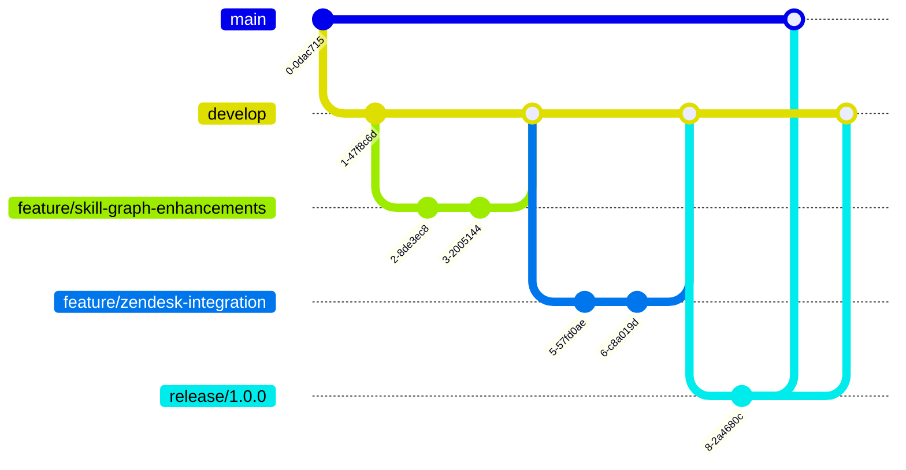

# Contributing Guide

This document outlines the process for contributing to the DoIT Skills Orchestration System, covering coding standards, pull request workflow, and best practices.

## Code of Conduct

All contributors are expected to adhere to our Code of Conduct. We are committed to providing a welcoming and inclusive environment for everyone.

## Development Process

### Branching Strategy

We follow a simplified GitFlow workflow:

- `main`: Production-ready code
- `develop`: Integration branch for features
- `feature/*`: Feature branches
- `bugfix/*`: Bug fix branches
- `release/*`: Release preparation branches
- `hotfix/*`: Emergency fixes for production



### Issue Workflow

1. **Issue Creation**: All work should be tied to an issue in the GitHub Issue Tracker
2. **Issue Assignment**: Assign the issue to yourself before starting work
3. **Issue Labels**: Use appropriate labels (bug, enhancement, documentation, etc.)
4. **Issue Reference**: Reference issues in commits and PRs

### Pull Request Process

1. Create a feature branch from `develop`:
   ```bash
   git checkout develop
   git pull
   git checkout -b feature/descriptive-name
   ```

2. Make your changes, following the coding standards

3. Write or update tests for your changes

4. Run the test suite:
   ```bash
   npm test
   ```

5. Update documentation as needed

6. Submit a pull request to the `develop` branch with:
   - Clear description of changes
   - Reference to related issues
   - Screen captures for UI changes
   - Mention of breaking changes, if any

7. PR Review Process:
   - Automated checks must pass
   - At least one approving review required
   - Author addresses feedback
   - Maintainer merges when ready

8. After merging, the feature branch is deleted

## Coding Standards

### TypeScript Guidelines

- Use TypeScript for all new code
- Maintain 90%+ type coverage
- Avoid `any` types when possible
- Use interfaces for data models
- Follow [ESLint](#linting) rules

### Style Guide

We follow a customized version of the Airbnb JavaScript Style Guide:

- Use 2 spaces for indentation
- Use semicolons at the end of statements
- Use single quotes for strings
- Use camelCase for variables and functions
- Use PascalCase for classes and interfaces
- Use UPPER_CASE for constants

### Linting

We use ESLint with the following configuration:

```json
{
  "extends": [
    "airbnb-typescript/base",
    "plugin:@typescript-eslint/recommended",
    "prettier"
  ],
  "plugins": ["import", "@typescript-eslint", "prettier"],
  "rules": {
    "prettier/prettier": "error",
    "no-console": ["error", { "allow": ["warn", "error", "info"] }],
    "import/prefer-default-export": "off",
    "@typescript-eslint/explicit-function-return-type": ["error", {
      "allowExpressions": true
    }]
  }
}
```

To check your code:

```bash
npm run lint
```

To automatically fix issues:

```bash
npm run lint:fix
```

### Testing Standards

- All new features must include tests
- Maintain 80%+ code coverage
- Write unit tests for utils and services
- Write integration tests for APIs
- Write end-to-end tests for critical workflows

Test structure:

```
├── __tests__/
│   ├── unit/
│   │   ├── services/
│   │   └── utils/
│   ├── integration/
│   │   ├── api/
│   │   └── db/
│   └── e2e/
│       └── workflows/
```

### Commit Message Format

We follow the Conventional Commits specification:

```
<type>(<scope>): <description>

[optional body]

[optional footer]
```

Types:
- `feat`: New feature
- `fix`: Bug fix
- `docs`: Documentation changes
- `style`: Formatting changes
- `refactor`: Code restructuring without behavior change
- `perf`: Performance improvements
- `test`: Test additions or updates
- `chore`: Changes to build process or tools

Example:

```
feat(skills-graph): add skill relationship visualization

- Added force-directed graph component
- Implemented zoom and pan controls
- Added hover tooltips for skill nodes

Closes #123
```

## Documentation Standards

### Code Documentation

- Use JSDoc comments for functions and classes
- Document parameter types, return values, and exceptions
- Include examples for complex functions

Example:

```typescript
/**
 * Calculates skill demand score based on various signals
 * 
 * @param {string} skillId - The skill identifier
 * @param {DemandSignal[]} signals - List of demand signals
 * @param {DemandOptions} [options] - Optional configuration
 * @returns {DemandScore} The calculated demand score
 * @throws {SkillNotFoundError} If skill ID is invalid
 * 
 * @example
 * const score = calculateDemandScore('skill-k8s-security', signals);
 * console.log(score.level); // 'High'
 */
function calculateDemandScore(
  skillId: string, 
  signals: DemandSignal[], 
  options?: DemandOptions
): DemandScore {
  // Implementation
}
```

### Repository Documentation

- Update README.md with significant changes
- Maintain up-to-date installation instructions
- Document environment variables
- Keep API documentation current

### Architecture Documentation

For significant architectural changes:

1. Create an Architecture Decision Record (ADR):
   ```
   docs/adr/NNNN-descriptive-title.md
   ```

2. Follow the ADR template:
   - **Title**: Short phrase summarizing the decision
   - **Status**: Proposed, Accepted, Deprecated, Superseded
   - **Context**: Problem being addressed
   - **Decision**: Change being implemented
   - **Consequences**: Impact of the decision
   - **Alternatives**: Options considered

## Component Contribution Guidelines

### Adding New Skills to Knowledge Graph

1. Define the skill in YAML format:

```yaml
id: skill-aws-lambda
name: AWS Lambda
description: Building and deploying AWS Lambda functions
domain: serverless
level: intermediate
prerequisites:
  - skill-aws-fundamentals
  - skill-javascript
related:
  - skill-aws-apigateway
  - skill-aws-dynamodb
certifications:
  - cert-aws-developer-associate
```

2. Add the skill to the appropriate domain file
3. Create appropriate relationships
4. Add tests for the skill definition

### Creating a New Integration

1. Implement the required interfaces:
   - `DataSource` for data collection
   - `DataTransformer` for mapping to system models
   - `DataSink` for storing processed data

2. Register the integration in the provider registry

3. Create configuration documentation

4. Add tests for each component

### Adding a New API Endpoint

1. Define the route in the appropriate service:

```typescript
router.get('/skills/:id/demand', 
  authenticate(),
  validateParams(demandParamsSchema),
  skillDemandController.getSkillDemand
);
```

2. Implement the controller function:

```typescript
export async function getSkillDemand(req: Request, res: Response): Promise<void> {
  try {
    const { id } = req.params;
    const period = req.query.period as string || '6m';
    
    const demandData = await skillService.getSkillDemand(id, period);
    
    res.json(demandData);
  } catch (error) {
    handleApiError(error, res);
  }
}
```

3. Add OpenAPI documentation:

```typescript
/**
 * @openapi
 * /skills/{id}/demand:
 *   get:
 *     summary: Get demand metrics for a skill
 *     parameters:
 *       - in: path
 *         name: id
 *         required: true
 *         schema:
 *           type: string
 *       - in: query
 *         name: period
 *         schema:
 *           type: string
 *           default: '6m'
 *     responses:
 *       200:
 *         description: Demand metrics for the skill
 *         content:
 *           application/json:
 *             schema:
 *               $ref: '#/components/schemas/SkillDemand'
 */
```

4. Create integration tests for the endpoint

## Release Process

### Version Numbering

We follow Semantic Versioning (SemVer):

- **Major** (`1.0.0`): Breaking changes
- **Minor** (`0.1.0`): New features, backward compatible
- **Patch** (`0.0.1`): Bug fixes, backward compatible

### Release Checklist

Before creating a release:

1. Ensure all tests pass
2. Run lint checks
3. Update CHANGELOG.md
4. Update version in package.json
5. Create a release branch
6. Build and test the production build
7. Update documentation if needed

### Release Creation

1. Merge the release branch to `main`
2. Create a tag with the version number:
   ```bash
   git tag -a v1.0.0 -m "Release v1.0.0"
   git push origin v1.0.0
   ```
3. Create a GitHub Release with release notes
4. Deploy to production

## Getting Help

- Join the #skills-orchestration channel in Slack
- Ask questions in GitHub Discussions
- Attend weekly developer office hours (Thursdays at 11am ET)
- Check the [FAQ](../faq.md) for common questions

Thank you for contributing to the DoIT Skills Orchestration System!