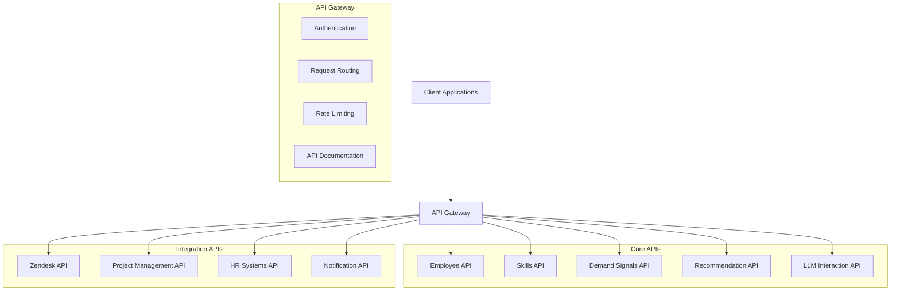

# API Specifications

This document outlines the API design for the DoIT Skills Orchestration System, defining how different components interact and how external systems integrate with the platform.

## Overview

The system implements a RESTful API architecture with GraphQL capabilities for complex queries. API design follows standard REST principles with JSON as the primary data format. Authentication is handled via OAuth 2.0 with JWT tokens.



## API Gateway

The API Gateway serves as the central entry point for all client interactions with the system, providing a unified interface while enabling decoupled microservices.

### Key Features

- **Authentication and Authorization**: Validates API keys and JWT tokens
- **Request Routing**: Directs requests to appropriate service endpoints
- **Rate Limiting**: Enforces usage quotas and prevents abuse
- **Request/Response Logging**: Records API usage for auditing and debugging
- **Response Caching**: Improves performance for frequently accessed data
- **Schema Validation**: Ensures request payloads conform to API specifications
- **Versioning**: Supports multiple API versions for backward compatibility
- **Documentation**: Provides interactive API documentation via Swagger/OpenAPI

### Base URL

```
https://api.skills-orchestration.doit.example.com/v1/
```

### Authentication

All API requests require authentication using OAuth 2.0 with JWT tokens.

#### Headers

```
Authorization: Bearer {jwt_token}
Content-Type: application/json
Accept: application/json
```

#### Response Codes

| Code | Description |
|------|-------------|
| 200 | Success |
| 201 | Resource created |
| 400 | Bad request |
| 401 | Unauthorized |
| 403 | Forbidden |
| 404 | Resource not found |
| 429 | Rate limit exceeded |
| 500 | Internal server error |