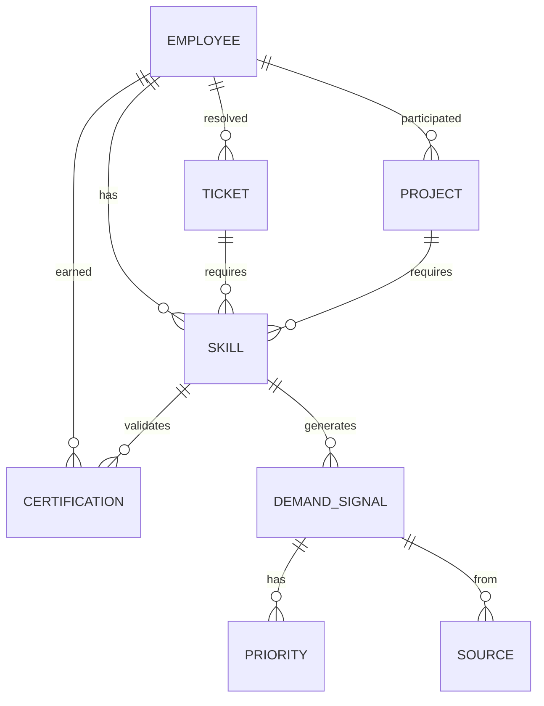

# Data Models

This document outlines the core data models that underpin the DoIT Skills Orchestration System, defining how information is structured, stored, and related.

## Overview

The system uses a combination of graph-based and relational data models to represent the complex relationships between skills, employees, demand signals, and organizational context.



## Core Data Models

### Skills Knowledge Graph

The Skills Knowledge Graph uses a property graph model to represent the complex relationships between different skills, technologies, and domains.

#### Node Types

| Node Type | Description | Key Properties |
|-----------|-------------|----------------|
| Skill | A specific capability or knowledge area | name, description, level, category |
| Technology | A specific tool, platform, or system | name, vendor, version, maturity |
| Domain | A broad area of technical expertise | name, description, industry_relevance |
| Role | A job function or position | title, department, level, required_skills |

#### Edge Types

| Edge Type | Source | Target | Properties |
|-----------|--------|--------|------------|
| Requires | Skill | Skill | strength, criticality |
| PartOf | Skill | Domain | centrality, specificity |
| UsedIn | Technology | Domain | prevalence, importance |
| ValidatedBy | Skill | Certification | coverage, validity |
| LeadsTo | Skill | Role | importance, sufficiency |

#### Example Skill Node (JSON)

```json
{
  "id": "skill-k8s-security",
  "type": "Skill",
  "properties": {
    "name": "Kubernetes Security",
    "description": "Knowledge of securing Kubernetes clusters, pods, and networking",
    "level": "Advanced",
    "category": "Security",
    "creation_date": "2023-11-15",
    "last_updated": "2024-03-20"
  }
}
```

#### Example Relationship (JSON)

```json
{
  "id": "rel-12345",
  "type": "Requires",
  "source": "skill-k8s-security",
  "target": "skill-k8s-basics",
  "properties": {
    "strength": 0.9,
    "criticality": "High",
    "creation_date": "2023-11-15"
  }
}
```

### Employee Profile Repository

The Employee Profile Repository stores information about individual employees, their skills, certifications, and career development.

#### Employee Model

```typescript
interface Employee {
  id: string;
  name: string;
  email: string;
  department: string;
  role: string;
  start_date: Date;
  skills: EmployeeSkill[];
  certifications: EmployeeCertification[];
  peer_recognitions: PeerRecognition[];
}

interface EmployeeSkill {
  skill_id: string;
  proficiency_level: "Beginner" | "Intermediate" | "Advanced" | "Expert";
  experience_years: number;
  last_used_date: Date;
  self_assessed: boolean;
  validated: boolean;
  validation_method?: "Certification" | "PeerReview" | "ManagerAssessment" | "PerformanceMetrics";
}

interface EmployeeCertification {
  certification_id: string;
  issued_date: Date;
  expiration_date?: Date;
  credential_id: string;
  issuing_authority: string;
  verification_url?: string;
}


interface PeerRecognition {
  skill_id: string;
  recognizer_id: string;
  date: Date;
  context: string;
  endorsement_level: "Knowledgeable" | "Proficient" | "Expert" | "Thought Leader";
}
```

### Demand Signal Database

The Demand Signal Database captures and categorizes indicators of skill needs from various sources.

#### Demand Signal Model

```typescript
interface DemandSignal {
  id: string;
  source: "ZenDesk" | "Project" | "Sales" | "Leadership" | "Market";
  signal_type: "Growing" | "Emerging" | "Stable" | "Declining";
  related_skills: RelatedSkill[];
  detection_date: Date;
  confidence: number; // 0-1 scale
  priority: "Low" | "Medium" | "High" | "Critical";
  metadata: ZenDeskMetadata | ProjectMetadata | SalesMetadata | LeadershipMetadata | MarketMetadata;
}

interface RelatedSkill {
  skill_id: string;
  relevance: number; // 0-1 scale
  demand_level: "Low" | "Medium" | "High";
  required_proficiency: "Beginner" | "Intermediate" | "Advanced" | "Expert";
}

interface ZenDeskMetadata {
  ticket_volume: number;
  avg_resolution_time: number;
  categorization: string[];
  trend_period_days: number;
  trend_percentage: number;
  avg_customer_impact: "Low" | "Medium" | "High";
}

interface ProjectMetadata {
  project_count: number;
  total_estimated_hours: number;
  avg_billing_rate: number;
  client_industries: string[];
  strategic_importance: "Low" | "Medium" | "High";
}

interface LeadershipMetadata {
  initiative_name: string;
  executive_sponsor: string;
  strategic_pillar: string;
  timeframe: "Current" | "Next Quarter" | "Next Year" | "Long Term";
  business_outcome: string;
}
```

### Integration Models

#### ZenDesk Integration

```typescript
interface ZenDeskTicket {
  id: string;
  subject: string;
  description: string;
  status: "New" | "Open" | "Pending" | "Solved" | "Closed";
  priority: "Low" | "Normal" | "High" | "Urgent";
  requester_id: string;
  assignee_id: string;
  created_at: Date;
  updated_at: Date;
  solved_at?: Date;
  tags: string[];
  custom_fields: Record<string, any>;
  
  // Extracted metadata
  cloud_environment?: string;
  technology_mentions: string[];
  complexity_score: number;
  resolution_path?: string;
  skill_requirements: TicketSkillRequirement[];
}

interface TicketSkillRequirement {
  skill_id: string;
  confidence: number;
  criticality: "Low" | "Medium" | "High";
}
```

#### Project Integration

```typescript
interface Project {
  id: string;
  name: string;
  description: string;
  client_id: string;
  status: "Planning" | "Active" | "Completed" | "Cancelled";
  start_date: Date;
  end_date?: Date;
  budget_hours: number;
  team_members: ProjectTeamMember[];
  required_skills: ProjectSkillRequirement[];
  deliverables: string[];
  success_metrics: string[];
}

interface ProjectTeamMember {
  employee_id: string;
  role: string;
  allocation_percentage: number;
  start_date: Date;
  end_date?: Date;
}

interface ProjectSkillRequirement {
  skill_id: string;
  importance: "Nice to Have" | "Important" | "Critical";
  required_level: "Beginner" | "Intermediate" | "Advanced" | "Expert";
  team_members_count: number;
}
```

### LLM Context Models

#### User Context

```typescript
interface UserContext {
  employee_id: string;
  conversation_id: string;
  session_start_time: Date;
  conversation_history: Message[];
  current_query: string;
  inferred_intent: "SkillGuidance" | "ProjectMatching" | "CertificationAdvice" | "PerformanceInsight" | "Other";
  authentication_level: "Authenticated" | "Unauthenticated";
  personalization: PersonalizationContext;
}

interface Message {
  timestamp: Date;
  sender: "User" | "System";
  content: string;
  message_type: "Query" | "Answer" | "Clarification" | "Notification";
  referenced_entities?: string[];
}

interface PersonalizationContext {
  top_skills: string[];
  active_certifications: string[];
  recent_tickets: string[];
  career_goals: string[];
  department: string;
  role: string;
}
```

#### Tool Context

```typescript
interface ToolContext {
  tool_id: string;
  tool_name: string;
  purpose: string;
  required_permissions: string[];
  input_schema: Record<string, any>;
  output_schema: Record<string, any>;
  last_execution?: {
    timestamp: Date;
    input: Record<string, any>;
    output: Record<string, any>;
    success: boolean;
    error_message?: string;
  };
}
```

## Data Relationships

### Skills to Demand Signals

- Each skill can be associated with multiple demand signals
- Demand signals can reference multiple skills with varying relevance scores
- Historical demand patterns are tracked for trend analysis
- Skills have hierarchical relationships (prerequisites, specializations)

### Employees to Skills

- Employees have multiple skills at different proficiency levels
- Skills can be validated through various mechanisms
- Skill acquisition is timestamped for growth tracking
- Peer recognition provides social validation of skill proficiency

### Projects to Skills

- Projects require multiple skills at specific proficiency levels
- Project outcomes provide evidence of skill application
- Team composition maps to collective skill requirements
- Project timelines influence skill development prioritization

## Storage Considerations

### Primary Storage Systems

| Data Category | Storage Type | Rationale |
|---------------|--------------|-----------|
| Skills Knowledge Graph | Graph Database | Best represents complex skill relationships |
| Employee Profiles | Document Database | Accommodates varying attribute sets |
| Demand Signals | Time Series Database | Optimized for temporal analysis |
| Integration Data | Relational Database | Structured data with fixed schemas |
| Conversation Context | In-Memory Store | Fast access for interactive sessions |

### Data Lifecycle Management

- **Real-time Data**: Ticket volume, active conversations
- **Near-term Data**: Recent projects, current quarter objectives
- **Long-term Data**: Historical trends, career progression
- **Archival Data**: Past projects, resolved tickets

## Data Governance
### Security Classifications

| Data Category | Classification | Access Control |
|---------------|----------------|---------------|
| Employee Skills | Confidential | Employee, Managers, System |
| Career Goals | Restricted | Employee, Direct Manager |
| Demand Signals | Internal | All Authenticated Users |
| Aggregate Insights | Public | All System Users |

### Compliance Considerations

- Personal data handling complies with relevant privacy regulations
- Employee performance metrics are protected with appropriate access controls
- Data retention policies align with organizational standards
- Consent mechanisms for peer recognition and skill assessment