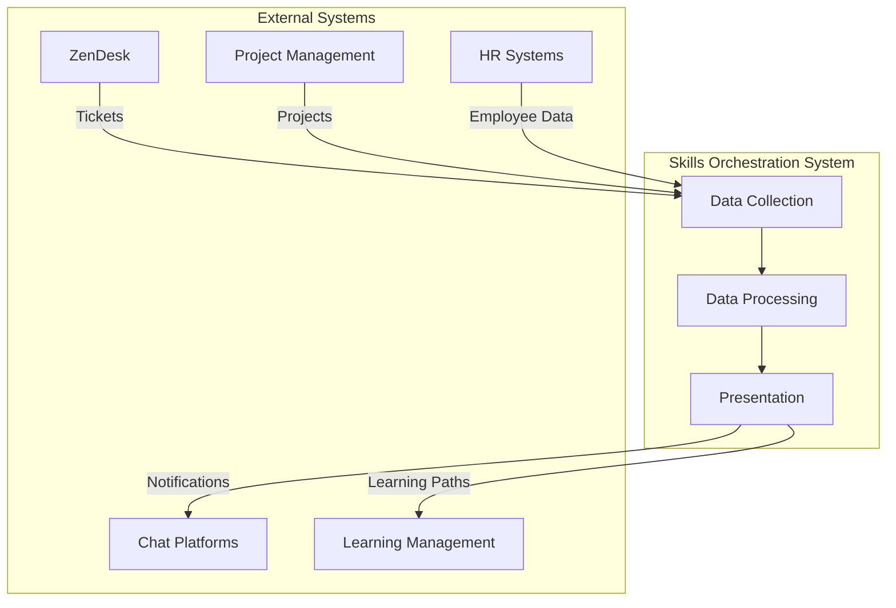
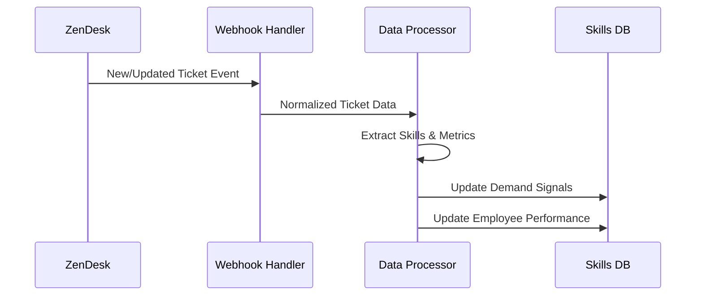
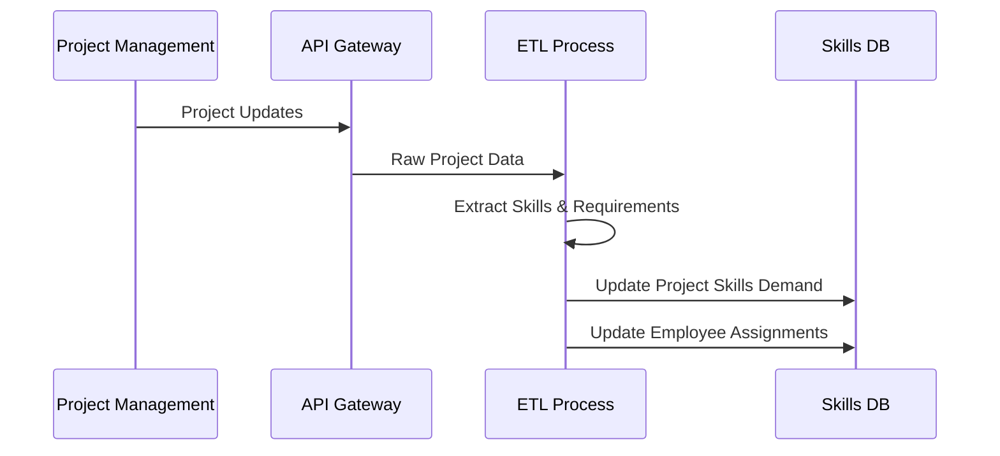
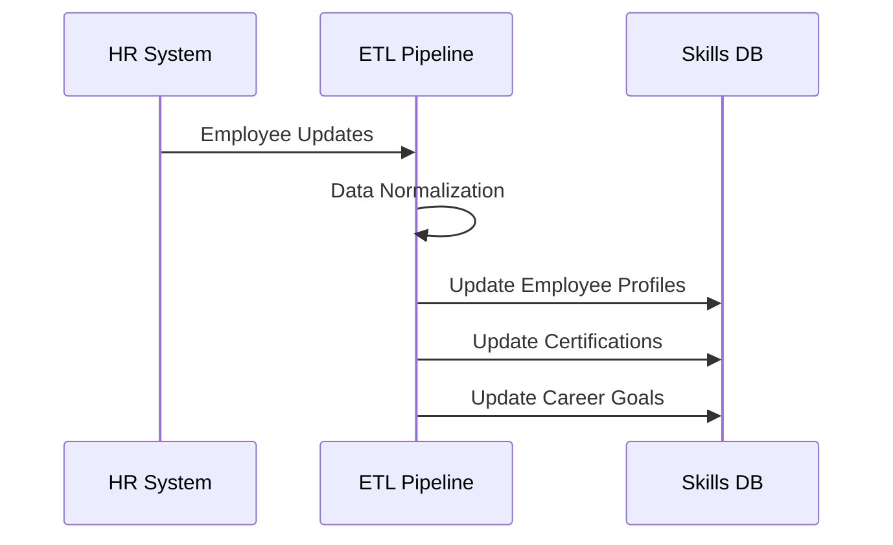
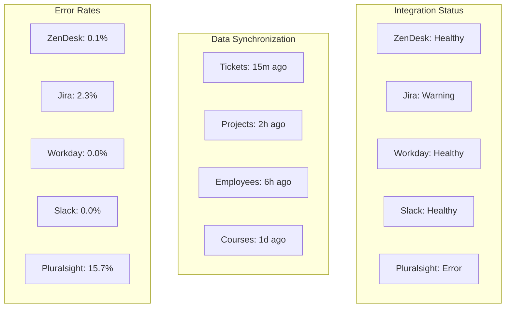

# Integrations

This document details the external system integrations that power the DoIT Skills Orchestration System, focusing on data flows, authentication methods, and configuration requirements.

## Overview

The system integrates with various external systems to collect demand signals, track skills, and deliver personalized guidance to employees.



## Core Integrations

### ZenDesk Integration

The ZenDesk integration captures ticket data to identify skill demand patterns and track employee performance.

#### Integration Architecture



#### Data Collection Methods

- **Event-Driven**: Webhook subscriptions for real-time ticket events
- **Periodic**: Scheduled API queries for ticket metrics and reporting
- **Historical**: One-time import for initial system seeding

#### Authentication

- **OAuth 2.0**: For API access with restricted scopes
- **Webhook Signatures**: For event verification
- **Service Account**: For scheduled background jobs

#### Data Mapping

| ZenDesk Field | System Mapping | Transformation |
|---------------|----------------|----------------|
| Ticket Subject | Initial categorization | NLP classification |
| Description | Skill extraction | Entity recognition |
| Tags | Direct skill mapping | Taxonomy alignment |
| Custom Fields: Technology | Explicit skill association | Direct mapping |
| Resolution Time | Performance metric | Time-based analysis |
| Satisfaction Rating | Quality metric | Normalized scoring |

#### Configuration Requirements

```yaml
zendesk:
  instance_url: "https://doit.zendesk.com"
  webhook_endpoint: "https://api.skills-orchestration.doit.example.com/v1/integrations/zendesk/webhook"
  api_version: "v2"
  scopes:
    - "read:tickets"
    - "read:users"
    - "read:organizations"
  polling_interval: 15m
  ticket_fields:
    technology_field_id: 12345
    environment_field_id: 67890
  skill_mapping:
    - tag: "kubernetes"
      skill_id: "skill-k8s-basics"
    - tag: "kubernetes-security"
      skill_id: "skill-k8s-security"
```

### Project Management Integration

Integrates with project management tools to identify skill requirements for upcoming projects and track utilization.

#### Supported Systems

- Jira
- Asana
- Monday.com
- Custom internal project management system

#### Integration Architecture



#### Data Collection Methods

- **API Polling**: Regular queries for project updates
- **Change Webhooks**: Event-based updates when available
- **Direct Database**: Read-only connection for supported systems

#### Authentication

- **OAuth 2.0**: For cloud-based systems
- **API Tokens**: For self-hosted systems
- **JWT**: For internal systems

#### Data Mapping

| Project Field | System Mapping | Transformation |
|---------------|----------------|----------------|
| Description | Skill extraction | NLP processing |
| Required Skills | Direct mapping | Taxonomy alignment |
| Team Members | Employee assignments | Role classification |
| Story Points | Effort estimation | Normalized workload |
| Project Timeline | Demand forecasting | Temporal distribution |

#### Configuration Example (Jira)

```yaml
project_management:
  type: "jira"
  instance_url: "https://doit.atlassian.net"
  api_version: "3"
  polling_interval: 30m
  projects:
    - key: "CLOUD"
      name: "Cloud Infrastructure"
    - key: "DEVOPS"
      name: "DevOps Initiatives"
  custom_fields:
    required_skills: "customfield_10892"
    technology_stack: "customfield_10765"
  skill_mapping:
    - jira_field: "labels"
      values:
        - label: "kubernetes"
          skill_id: "skill-k8s-basics"
        - label: "aws"
          skill_id: "skill-aws-fundamentals"
```

### HR System Integration

Connects with HR systems to retrieve employee data, certifications, and career development information.

#### Supported Systems

- Workday
- BambooHR
- SAP SuccessFactors
- Custom internal HR system

#### Integration Architecture



#### Data Collection Methods

- **Batch ETL**: Regular data extraction and loading
- **API Integration**: Real-time data access where available
- **CDC (Change Data Capture)**: For database-level integration

#### Authentication

- **SAML**: For enterprise identity federation
- **OAuth 2.0**: For API access
- **Service Accounts**: For ETL processes

#### Data Mapping

| HR Field | System Mapping | Transformation |
|----------|----------------|----------------|
| Job Title | Role association | Role taxonomy mapping |
| Department | Organizational context | Hierarchy resolution |
| Certifications | Skill validation | Expiration tracking |
| Years of Experience | Expertise level | Weighted calculation |
| Career Goals | Development targets | Skill path generation |

#### Configuration Example (Workday)

```yaml
hr_system:
  type: "workday"
  instance_url: "https://doit.workday.com"
  integration_tenant: "doit_prod"
  sync_schedule: "0 0 * * *" # Daily at midnight
  endpoints:
    - name: "employees"
      path: "/workers"
      incremental: true
    - name: "certifications"
      path: "/worker_certification"
      incremental: false
  field_mapping:
    employee_id: "worker_id"
    name: "legal_name"
    job_level: "job_profile.level"
    department: "organization_data.department"
    manager: "manager_reference"
```

## Secondary Integrations

### Chat Platform Integration

Enables interaction with the system through popular messaging platforms.

#### Supported Platforms

- Slack
- Microsoft Teams
- Google Chat
- Discord (for development teams)

#### Integration Capabilities

- **Natural Language Queries**: Ask questions about skills and demand
- **Notifications**: Receive alerts about relevant opportunities
- **Quick Actions**: Respond to recommendations with one-click actions
- **Rich Responses**: Interactive cards with visualization capabilities

#### Authentication and Security

- **Bot Tokens**: Platform-specific authentication
- **User Identity**: Mapping chat users to employee profiles
- **Permission Scopes**: Limited to necessary capabilities
- **Data Retention**: Minimal storage in chat platforms

#### Slack Configuration Example

```yaml
chat_integration:
  type: "slack"
  bot_token: "${SLACK_BOT_TOKEN}"
  signing_secret: "${SLACK_SIGNING_SECRET}"
  app_id: "A012BC3D4EF"
  permitted_channels:
    - "#career-development"
    - "#skill-building"
    - "#certification-study"
  direct_message_enabled: true
  commands:
    - name: "/skills-needed"
      description: "Find skills in high demand"
    - name: "/certifications"
      description: "Get certification recommendations"
  notifications:
    default_channel: "#career-development"
    user_preferences_enabled: true
```

### Learning Management System (LMS) Integration

Connects with learning platforms to recommend relevant courses and track skill development.

#### Supported Systems

- Coursera for Business
- Pluralsight
- LinkedIn Learning
- Internal training portal

#### Integration Capabilities

- **Course Discovery**: Find relevant learning materials for recommended skills
- **Enrollment Tracking**: Monitor progress through learning paths
- **Completion Verification**: Update skill status upon course completion
- **Learning Path Creation**: Generate personalized development plans

#### Data Synchronization

- **Course Catalog**: Regular import of available learning resources
- **Skill Mapping**: Association of courses with specific skills
- **Progress Tracking**: Bidirectional updates on completion status
- **Learning Analytics**: Aggregated insights on effective learning paths

#### Configuration Example (Pluralsight)

```yaml
lms_integration:
  type: "pluralsight"
  api_key: "${PLURALSIGHT_API_KEY}"
  team_id: "team_123456"
  sync_interval: "12h"
  skill_mapping:
    - skill_id: "skill-k8s-security"
      courses:
        - id: "kubernetes-security-fundamentals"
          level: "Intermediate"
        - id: "securing-kubernetes-clusters"
          level: "Advanced"
    - skill_id: "skill-terraform"
      channels:
        - id: "terraform-path"
```

## Integration Monitoring and Management

### Health Monitoring

- **Connection Status**: Real-time monitoring of integration connectivity
- **Error Rates**: Tracking of failed requests and data validation issues
- **Data Freshness**: Metrics on last successful synchronization
- **Rate Limit Tracking**: Monitoring of API quota consumption

### Dashboard



### Circuit Breakers

- **Automatic Disabling**: Temporarily disable integrations with high error rates
- **Rate Limiting**: Adaptive throttling based on external system responsiveness
- **Fallback Mechanisms**: Alternative data sources when primary integration fails
- **Recovery Procedures**: Automatic retry strategies with exponential backoff

### Data Reconciliation

- **Conflict Resolution**: Strategies for handling conflicting data from multiple sources
- **Identity Resolution**: Matching users across different systems
- **Validation Rules**: Data quality checks before ingestion
- **Audit Trails**: Tracking of all integration-driven data changes

## Integration Development and Extension

### Integration SDK

The system provides an SDK for developing new integrations with standardized patterns:

```typescript
import { Integration, DataSource, Mapping } from '@doit/integration-sdk';

class CustomProjectManagementIntegration extends Integration {
  constructor(config: CustomPMConfig) {
    super('custom-pm', config);
    this.registerDataSource(new ProjectDataSource(config));
    this.registerDataSource(new TeamDataSource(config));
    this.registerMapping(new ProjectToSkillMapping());
  }
  
  async validateConnection(): Promise<ConnectionStatus> {
    // Implementation
  }
  
  async sync(): Promise<SyncResult> {
    // Implementation
  }
}
```

### Testing Utilities

- **Mock Servers**: Simulated external systems for integration testing
- **Validation Tools**: Data quality verification utilities
- **Load Testing**: Scalability testing under various data volumes
- **Certification Process**: Formal validation of new integrations

### Documentation Requirements

New integrations must provide:

1. Authentication and security documentation
2. Data mapping specifications
3. Configuration examples
4. Rate limit and performance characteristics
5. Error handling and recovery procedures