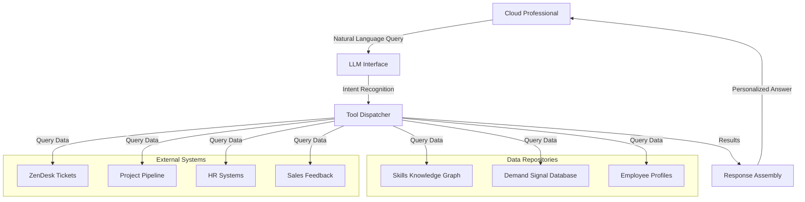

# DoIT Skills Orchestration System

Welcome to the documentation for DoIT's Human-Centric Skills Orchestration System.

## About the System

The Skills Orchestration System is designed to connect DoIT employees with growth opportunities based on real-time demand signals. By intelligently analyzing ticket patterns, project requirements, and strategic priorities, the system provides personalized recommendations while respecting individual autonomy and career goals.

## Key Features

- **Natural Language Interface**: Ask questions about skills and opportunities in plain English
- **Real-time Demand Analysis**: Insights based on current ZenDesk tickets and project requests
- **Personalized Recommendations**: Career guidance tailored to your unique skills and interests
- **Transparent Incentives**: Clear rewards for acquiring high-demand skills
- **Cross-Department Visibility**: Opportunities across cloud support, FinOps, and project teams

## Quick Navigation

| Documentation Section | Description |
|----------------------|-------------|
| [System Overview](overview.md) | Core principles and components |
| [Architecture](architecture.md) | Technical architecture and system design |
| [User Stories](user-stories.md) | Example usage scenarios and requirements |
| [Design Decisions](decisions.md) | Key architectural and ethical decisions |

## Getting Started

If you're a:

- **Cloud Professional**: Start by exploring the [User Stories](user-stories.md) to see how the system can help your career development
- **Manager**: Check out the [System Overview](overview.md) to understand how the system aligns skills with business needs
- **Developer**: Begin with the [Architecture](architecture.md) document to understand the technical implementation

## System Diagram

## Ethical Principles

The system is designed with human-centric principles at its core:

- **Autonomy**: Employees always choose their own learning path
- **Transparency**: Clear explanations for all recommendations
- **Privacy**: Careful handling of personal career information
- **Fairness**: Equal opportunity across departments and roles

## Contact

For questions about this documentation or the Skills Orchestration System, please contact nathan@doit.com